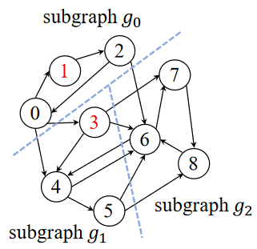

> 在博士申请时，发现很多博导的研究方向包括了图计算，本文通过一篇浙江大学在ATC2024的工作简单了解下图计算到底是什么？有哪些研究方向？

基本概念
===
vertex: 顶点
adjacency  vertices list: 邻接列表
out-graph, in-graph: 出图，入图
> Out-graph 是指从一个特定顶点出发可以到达的所有顶点和边构成的子图。更具体地说，这涉及到从一个顶点 vv 出发，通过它的出边所能直接或间接到达的所有顶点和这些连接的边。在有向图中，一个顶点的 “out-graph” 描述了数据、信息或任何形式的流动可以从该顶点出发传递到哪些顶点。

**论文名称：** Efficient Large Graph Processing with Chunk-Based Graph Representation Model (ATC 2024, CCF-Rank A)

解决两个问题：
1. I/O利用率：
> For instance, when executing the BFS algorithm on the YahooWeb graph, the average I/O utilization is observed to be lower than 2% when using the latest external graph system Blaze
> TODO:说明
2. 同步过程(additional computational overhead resulting from synchronization between subgraphs)
> TODO:说明
3. Additionally, utilizing these external graph systems leads to expensive algorithm development costs, as users are compelled to reimplement their graph algorithms based on the subgraph-centric computation model.

看完感觉只是对方法有了了解，但是对背景知识还是不够

欠缺：
Page-centric memory caching scheme

large graph processing