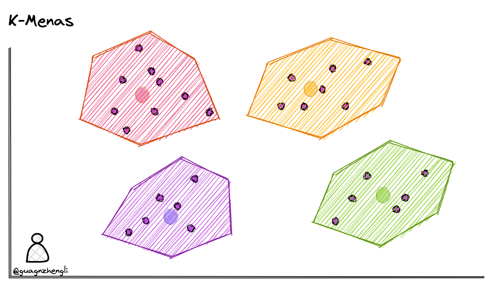
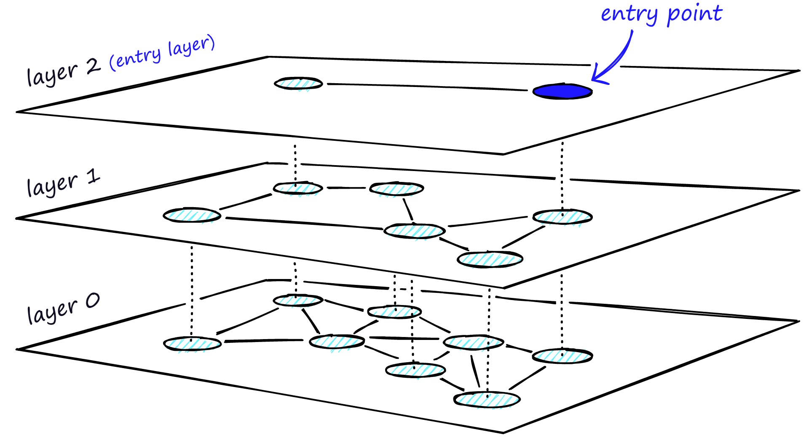
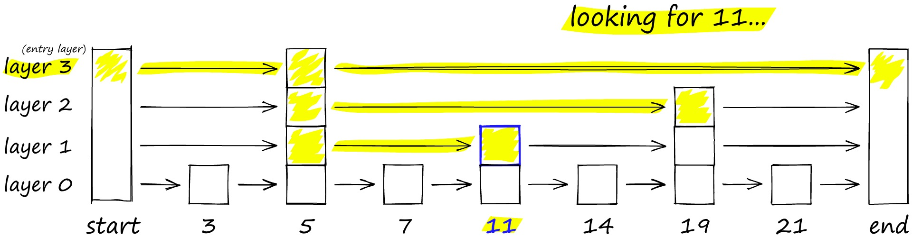
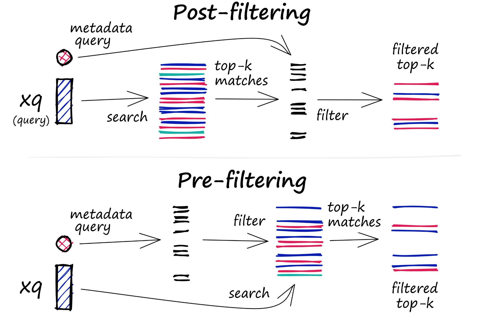

参考自 https://guangzhengli.com/blog/zh/vector-database/

语言模型的做法就是将用户的输入通过Embedding，作为上下文，让模型回答内容。然而目前的语言模型都存在Tokens的限制，比如32K，128K。

在 GPT 模型的限制下，开发者们不得不寻找其他的解决方案，而向量数据库就是其中之一。向量数据库的核心思想是将文本转换成向量，然后将向量存储在数据库中，当用户输入问题时，将问题转换成向量，然后在数据库中搜索最相似的向量和上下文，最后将文本返回给用户。

当我们有一份文档需要 GPT 处理时，例如这份文档是客服培训资料或者操作手册，我们可以先将这份文档的所有内容转化成向量（这个过程称之为 Vector Embedding），然后当用户提出相关问题时，我们将用户的搜索内容转换成向量，然后在数据库中搜索最相似的向量，匹配最相似的几个上下文，最后将上下文返回给 GPT。这样不仅可以大大减少 GPT 的计算量，从而提高响应速度，更重要的是降低成本，并绕过 GPT 的 tokens 限制。

**核心就是通过向量数据库，希望可以直接定位到最相关的上下文，将该部分上下文与问题一起输入到LLM中，而不用输入整个上下文**

So，如何进行**相似搜索**呢？直接按照List依次比较肯定不行，我们需要一个更快的算法或者数据结构来解决Similar Search的问题

K-Means
========

常见的聚类算法有 K-Means，它可以将数据分成 k 个类别，其中 k 是预先指定的。以下是 k-means 算法的基本步骤：

1. 选择 k 个初始聚类中心。
2. 将每个数据点分配到最近的聚类中心。
3. 计算每个聚类的新中心。
4. 重复步骤 2 和 3，直到聚类中心不再改变或达到最大迭代次数。

**缺点(网络版)**
- 需要保存每个向量的坐标，而每个坐标都是一个浮点数，占用的内存很高
- 需要维护聚类中心和每个向量的聚类中心索引

**缺点(个人版)**
个人感觉聚类中心以及每个向量聚类中心的索引所占内存开销，远小于数据点的存储开销，这部分甚至可以忽略不计。个人感觉K-Means有以下不适应的地方：
- 不适用于频繁修改或者说有新节点加入的情况（每次修改或者说更新，整个K-Means都需要重新计算来更新聚类结果）
- 聚类算法一开始要指定有多少个聚类中心，但在实际使用中，这个值一开始是未知的（不知道现有聚类算法是否支持聚类中心的个数自适应）
- 多少个聚类中心才算合适？
- 高维向量本身所占内存空间（普遍问题）

Hierarchical Navigable Small Worlds (HNSW)
===
除了聚类以外，也可以通过构建树或者构建图的方式来实现近似最近邻搜索。这种方法的基本思想是每次将向量加到数据库中的时候，就先找到与它最相邻的向量，然后将它们连接起来，这样就构成了一个图。当需要搜索的时候，就可以从图中的某个节点开始，不断的进行最相邻搜索和最短路径计算，直到找到最相似的向量。

这种算法能保证搜索的质量，但是如果图中所以的节点都以最短的路径相连，如图中最下面的一层，那么在搜索的时候，就同样需要遍历所有的节点。

解决这个问题的思路与常见的跳表算法相似，如下图要搜索跳表，从最高层开始，沿着具有最长“跳过”的边向右移动。如果发现当前节点的值大于要搜索的值-我们知道已经超过了目标，因此我们会在下一级中向前一个节点。

HNSW 继承了相同的分层格式，最高层具有更长的边缘（用于快速搜索），而较低层具有较短的边缘（用于准确搜索）。

具体来说，可以将图分为多层，每一层都是一个小世界，图中的节点都是相互连接的。而且每一层的节点都会连接到上一层的节点，当需要搜索的时候，就可以从第一层开始，因为第一层的节点之间距离很长，可以减少搜索的时间，然后再逐层向下搜索，又因为最下层相似节点之间相互关联，所以可以保证搜索的质量，能够找到最相似的向量。

如果你对跳表和 HNSW 感兴趣，可以看看[这个视频](https://www.youtube.com/watch?v=QvKMwLjdK-s&t=168s&ab_channel=JamesBriggs)。

HNSW 算法是一种经典的空间换时间的算法，它的搜索质量和搜索速度都比较高，但是它的内存开销也比较大，因为不仅需要将所有的向量都存储在内存中。还需要维护一个图的结构，也同样需要存储。所以这类算法需要根据实际的场景来选择。

Locality Sensitive Hashing (LSH)
===
局部敏感哈希（Locality Sensitive Hashing）也是一种使用近似最近邻搜索的索引技术。它的特点是快速，同时仍然提供一个近似、非穷举的结果。LSH 使用一组哈希函数将相似向量映射到“桶”中，从而使相似向量具有相同的哈希值。这样，就可以通过比较哈希值来判断向量之间的相似度。

通常，我们设计的哈希算法都是力求减少哈希碰撞的次数，因为哈希函数的搜索时间复杂度是 O(1)，但是，如果存在哈希碰撞，即两个不同的关键字被映射到同一个桶中，那么就需要使用链表等数据结构来解决冲突。在这种情况下，搜索的时间复杂度通常是 O(n)，其中n是链表的长度。所以为了提高哈希函数的搜索的效率，通常会将哈希函数的碰撞概率尽可能的小。

但是在向量搜索中，我们的目的是为了找到相似的向量，所以可以专门设计一种哈希函数，使得哈希碰撞的概率尽可能高，并且位置越近或者越相似的向量越容易碰撞，这样相似的向量就会被映射到同一个桶中。

等搜索特定向量时，为了找到给定查询向量的最近邻居，使用相同的哈希函数将类似向量“分桶”到哈希表中。查询向量被散列到特定表中，然后与该表中的其他向量进行比较以找到最接近的匹配项。这种方法比搜索整个数据集要快得多，因为每个哈希表桶中的向量远少于整个空间中的向量数。

那么这个哈希函数应该如何设计呢？为了大家更好理解，我们先从二维坐标系解释，如下所图示，在二维坐标系中可以通过随机生成一条直线，将二维坐标系划分为两个区域，这样就可以通过判断向量是否在直线的同一边来判断它们是否相似。例如下图通过随机生成 4 条直线，这样就可以通过 4 个二进制数来表示一个向量的位置，例如 A 和 B 表示向量在同一个区域。

Random Projection for LSH 随机投影
===

如果在二维坐标系可以通过随机生成的直线区分相似性，那么同理，在三维坐标系中，就可以通过随机生成一个平面，将三维坐标系划分为两个区域。在多维坐标系中，同样可以通过随机生成一个超平面，将多维坐标系划分为两个区域，从而区分相似性。

但是在高维空间中，数据点之间的距离往往非常稀疏，数据点之间的距离会随着维度的增加呈指数级增长。导致计算出来的桶非常多，最极端的情况是每个桶中就一个向量，并且计算速度非常慢。所以实际上在实现 LSH 算法的时候，会考虑使用随机投影的方式，将高维空间的数据点投影到低维空间，从而减少计算的时间和提高查询的质量。

随机投影背后的基本思想是使用随机投影矩阵将高维向量投影到低维空间中。创建一个由随机数构成的矩阵，其大小将是所需的目标低维值。然后，计算输入向量和矩阵之间的点积，得到一个被投影的矩阵，它比原始向量具有更少的维度但仍保留了它们之间的相似性。

当我们查询时，使用相同的投影矩阵将查询向量投影到低维空间。然后，将投影的查询向量与数据库中的投影向量进行比较，以找到最近邻居。由于数据的维数降低了，搜索过程比在整个高维空间中搜索要快得多。

其基本步骤是：

1. 从高维空间中随机选择一个超平面，将数据点投影到该超平面上。
2. 重复步骤 1，选择多个超平面，将数据点投影到多个超平面上。
3. 将多个超平面的投影结果组合成一个向量，作为低维空间中的表示。
4. 使用哈希函数将低维空间中的向量映射到哈希桶中。

过滤 (Filtering)
===
在实际的业务场景中，往往不需要在整个向量数据库中进行相似性搜索，而是通过部分的业务字段进行过滤再进行查询。所以存储在数据库的向量往往还需要包含元数据，例如用户 ID、文档 ID 等信息。这样就可以在搜索的时候，根据元数据来过滤搜索结果，从而得到最终的结果。

为此，向量数据库通常维护两个索引：一个是向量索引，另一个是元数据索引。然后，在进行相似性搜索本身之前或之后执行元数据过滤，但无论哪种情况下，都存在导致查询过程变慢的困难。

过滤过程可以在向量搜索本身之前或之后执行，但每种方法都有自己的挑战，可能会影响查询性能：

- Pre-filtering：在向量搜索之前进行元数据过滤。虽然这可以帮助减少搜索空间，但也可能导致系统忽略与元数据筛选标准不匹配的相关结果。
- Post-filtering：在向量搜索完成后进行元数据过滤。这可以确保考虑所有相关结果，在搜索完成后将不相关的结果进行筛选。
  
为了优化过滤流程，向量数据库使用各种技术，例如利用先进的索引方法来处理元数据或使用并行处理来加速过滤任务。平衡搜索性能和筛选精度之间的权衡对于提供高效且相关的向量数据库查询结果至关重要。

向量数据库选型
===
笔者在本文中，花费了大量的笔墨来介绍向量数据库的相似性搜索算法的原理和实现，相似性搜索算法固然是一个向量数据库的核心和关键点，但是在实际的业务场景中，往往还需要考虑其它的因素，例如向量数据库的可用性、扩展性、安全性等，还有代码是否开源、社区是否活跃等等。

分布式
===

一个成熟的向量数据库，往往需要支持分布式部署，这样才能满足大规模数据的存储和查询。数据拥有的越多，需要节点就越多，出现的错误和故障也就越多，所以分布式的向量数据库需要具备高可用性和容错性。

数据库的高可用性和容错性，往往需要实现分片和复制能力，在传统的数据库中，往往通过数据的主键或者根据业务需求进行分片，但是在分布式的向量数据库中，就需要考虑根据向量的相似性进行分区，以便查询的时候能够保证结果的质量和速度。

其它类似复制节点数据的一致性、数据的安全性等等，都是分布式向量数据库需要考虑的因素。

访问控制和备份
===

除此之外，访问控制设计的是否充足，例如当组织和业务快速发展时，是否能够快速的添加新的用户和权限控制，是否能够快速的添加新的节点，审计日志是否完善等等，都是需要考虑的因素。

另外，数据库的监控和备份也是一个重要的因素，当数据出现故障时，能够快速的定位问题和恢复数据，是一个成熟的向量数据库必须要考虑的因素。

API & SDK
===

对比上面的因素选择，API & SDK 可能是往往被忽略的因素，但是在实际的业务场景中，API & SDK 往往是开发者最关心的因素。因为 API & SDK 的设计直接影响了开发者的开发效率和使用体验。一个优秀良好的 API & SDK 设计，往往能够适应需求的不同变化，向量数据库是一个新的领域，在如今大部分人不太清楚这方面需求的当下，这一点容易被人忽视。

选型
===

截至目前，汇总到目前的向量数据库有以下几种选择：

| 项目名称   | URL                                      | GitHub Star | Language       | Cloud |
|----------|------------------------------------------|-------------|----------------|-------|
| chroma   | https://github.com/chroma-core/chroma    | 7.4K        | Python         | ❌     |
| milvus   | https://github.com/milvus-io/milvus      | 21.5K       | Go/Python/C++  | ✅     |
| pinecone | https://www.pinecone.io/                 | ❌          | ❌              | ✅     |
| qdrant   | https://github.com/qdrant/qdrant         | 11.8K       | Rust           | ✅     |
| typesense| https://github.com/typesense/typesense  | 12.9K       | C++            | ❌     |
| weaviate | https://github.com/weaviate/weaviate     | 6.9K        | Go             | ✅     |

